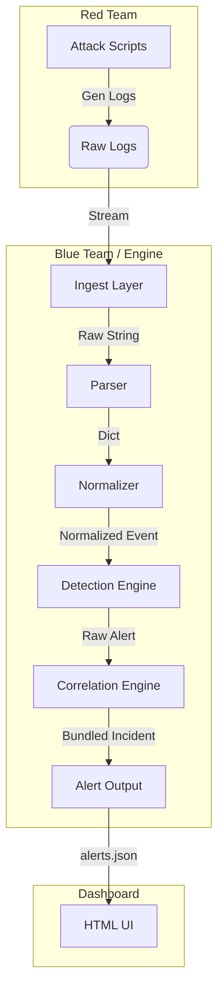

# System Architecture

## High-Level Diagram

## Components

### 1. Ingestion & Normalization (`engine/ingest.py`, `engine/normalize.py`)
- **Ingest**: Reads file streams or batches.
- **Parser**: Regex/JSON parsing.
- **Normalizer**: Maps to standard fields: `event_type`, `user`, `src_ip`, `action`, `resource`.

### 2. Detection Engine (`engine/detector.py`)
- Loops through YAML rules in `detections/`.
- Checks `condition` against normalized events.
- Skips if `false_positives` match.

### 3. Correlation Engine (`engine/correlator.py`)
- **Time-Window Logic**: Aggregates alerts within a sliding window (e.g., 5 mins).
- **Sequence Detection**: Detects patterns like "Failed Login" x5 -> "Success".

### 4. Data Storage
- **Logs**: `logs/*.log`
- **Alerts**: `alerts/alerts.json`
